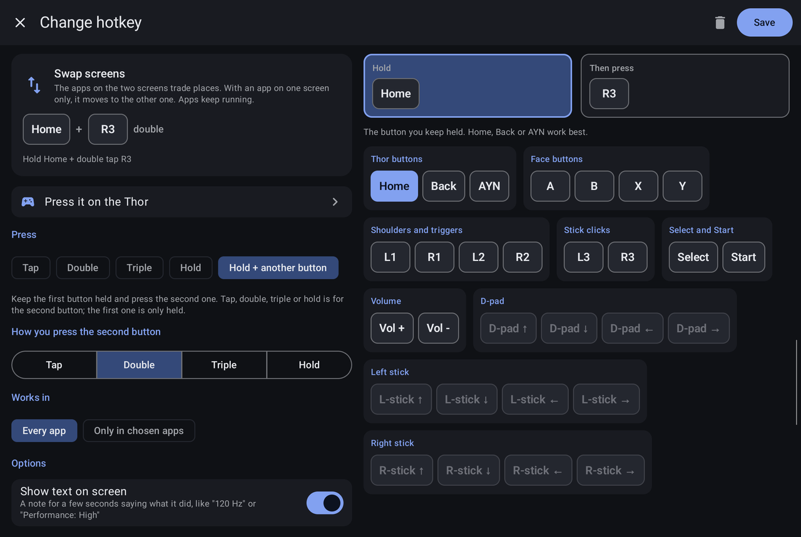
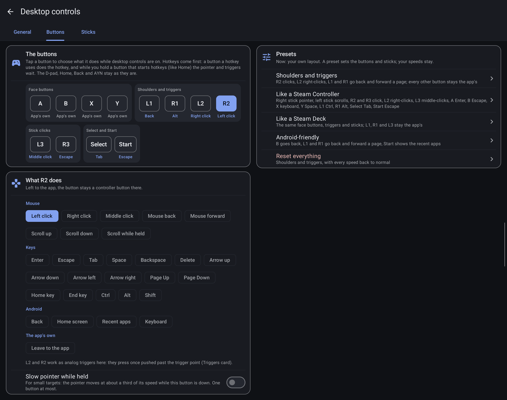
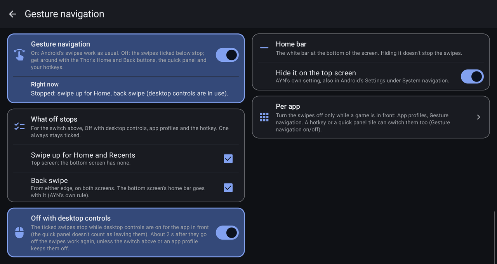
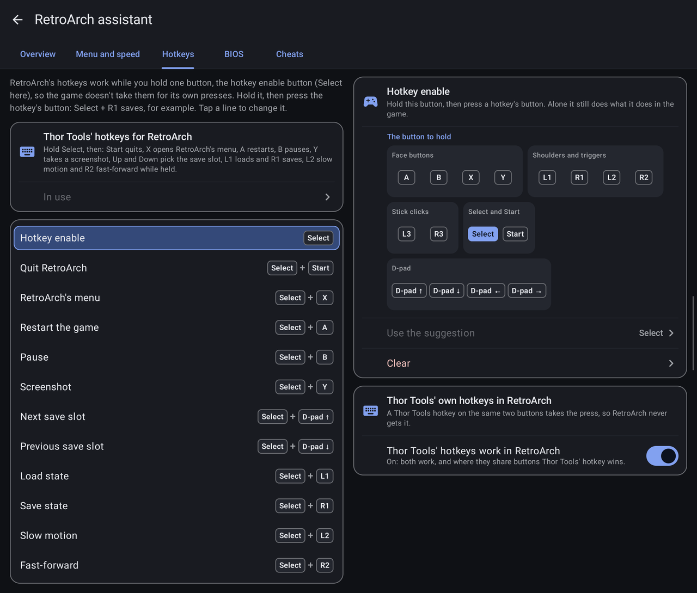
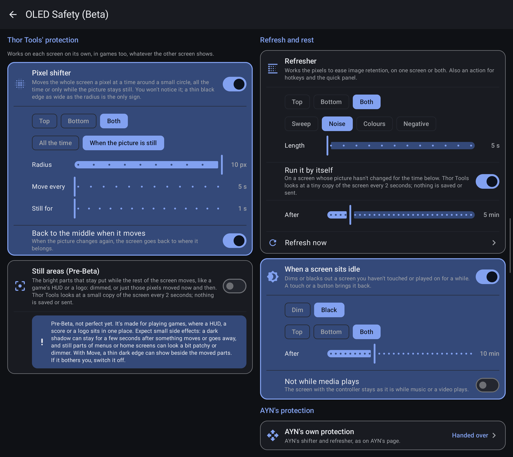
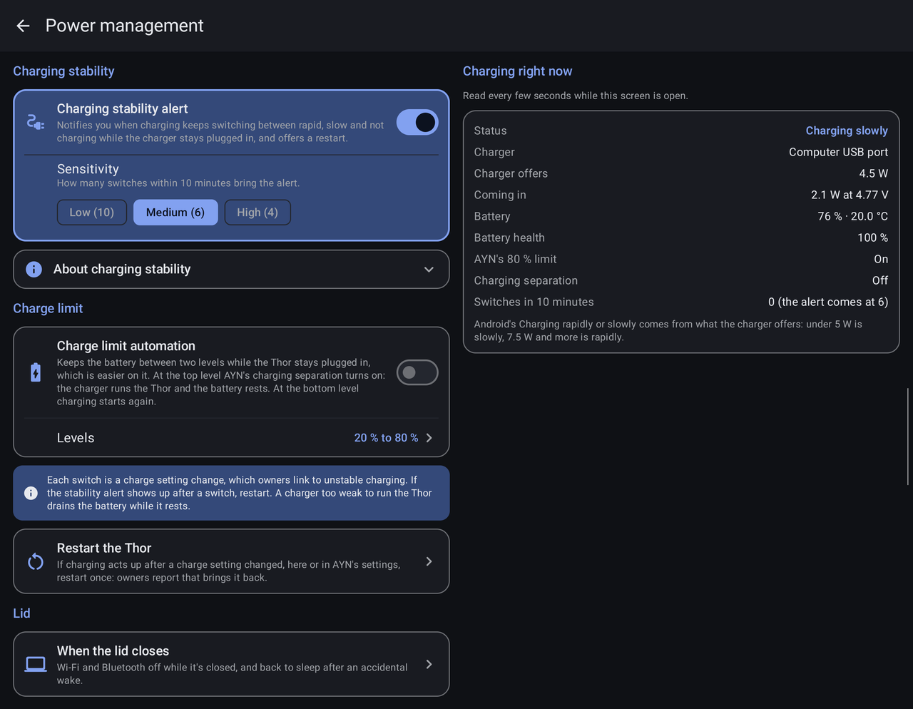
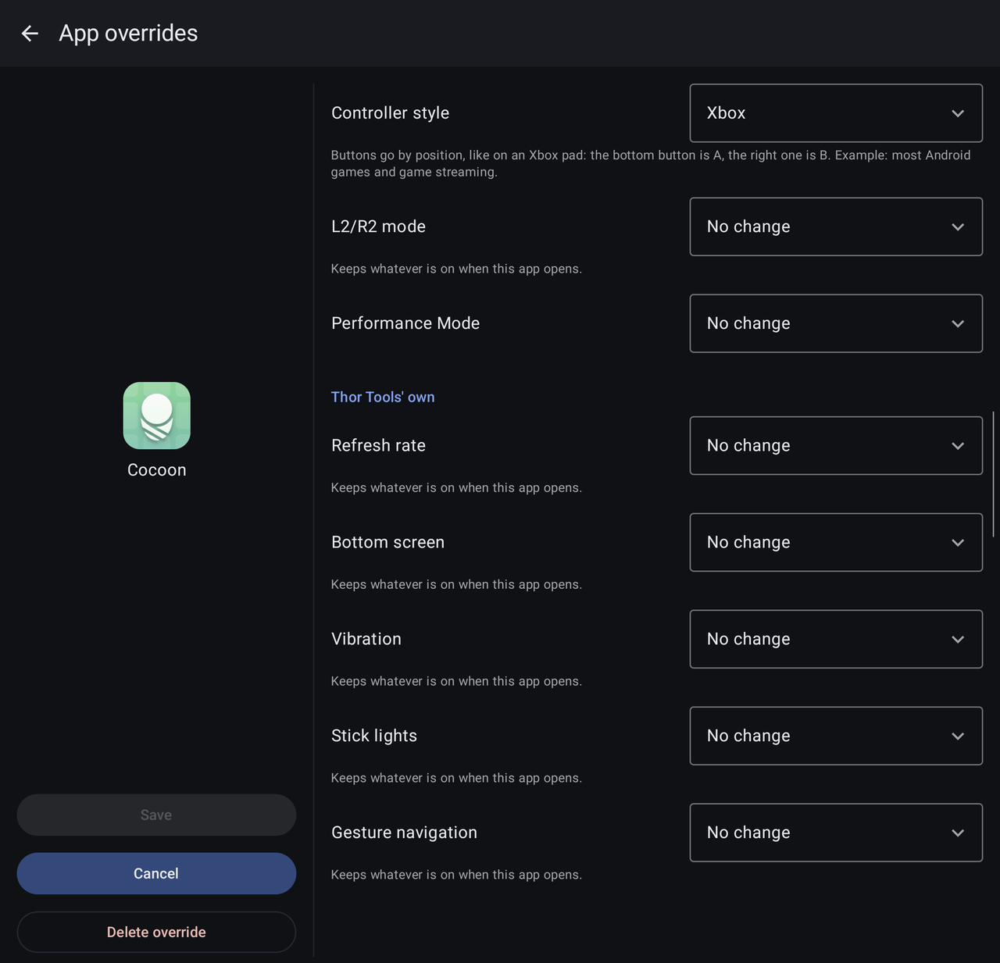
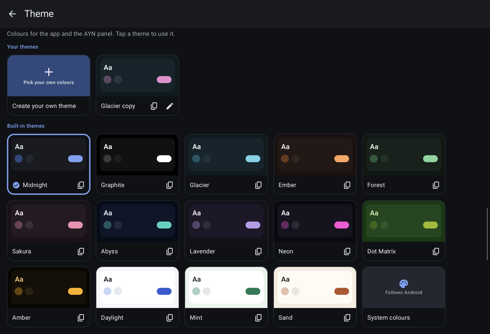
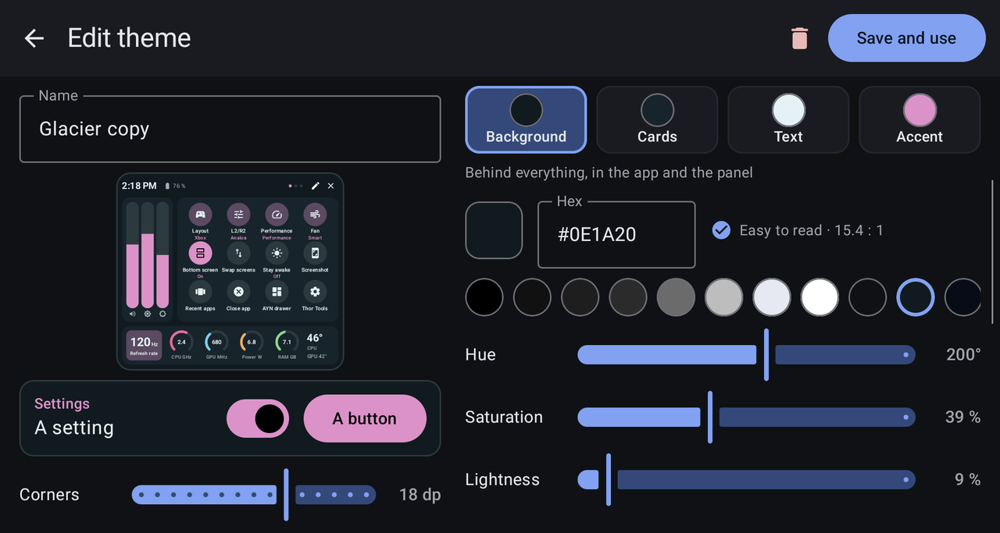
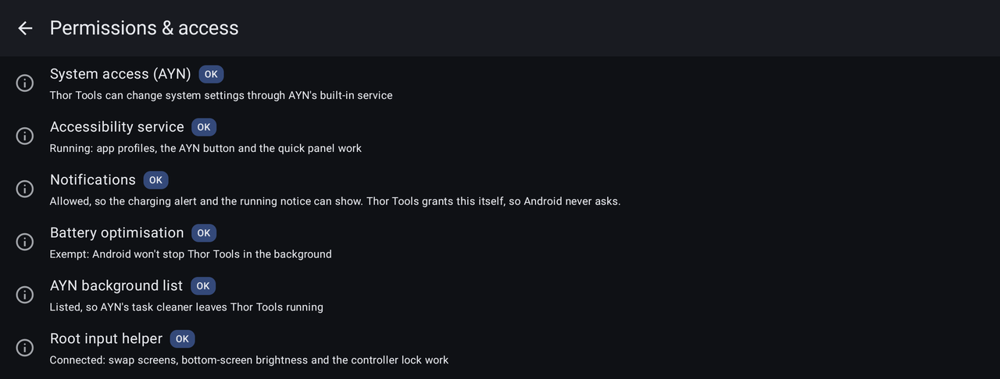

<p align="center">
  
</p>

<h1 align="center">Thor Tools</h1>

<p align="center">
  A companion app for the AYN Thor: a quick panel on the AYN button, hotkeys for both screens, desktop controls,
  emulator helpers, OLED protection and more.
</p>

<p align="center">
  <a href="https://github.com/ThatOneCodingPerson/ThorTools/releases/latest"><b>Download the latest release</b></a>
  &nbsp;·&nbsp;
  <a href="#features-at-a-glance">Features</a>
  &nbsp;·&nbsp;
  <a href="#install">Install</a>
</p>

<p align="center"></p>

Thor Tools makes more of what the Thor has: two screens, an AYN button, a lid and a controller that can do more than
play games. It started as a fork of [OdinTools](https://github.com/langerhans/OdinTools) by langerhans, keeps every
OdinTools setting and also runs on the Odin 2. It works through AYN's built-in system service, so there's no root,
Shizuku or ADB to set up.

## Features at a glance

<table>
  <tr>
    <td width="33%" valign="top"><a href="#quick-panel"><b>Quick panel</b></a><br>Tiles, sliders and 16 widgets, one tap of the AYN button away</td>
    <td width="33%" valign="top"><a href="#hotkeys"><b>Hotkeys</b></a><br>Taps, holds and combos of the Thor's buttons</td>
    <td width="33%" valign="top"><a href="#desktop-controls"><b>Desktop controls</b></a><br>The controller as a mouse and keyboard</td>
  </tr>
  <tr>
    <td valign="top"><a href="#controller-and-the-two-screens"><b>Two screens</b></a><br>Swap apps, move and lock the controller</td>
    <td valign="top"><a href="#gesture-navigation"><b>Gesture navigation</b></a><br>Android's swipes off for good, or just the white bar</td>
    <td valign="top"><a href="#retroarch-assistant"><b>RetroArch assistant</b></a><br>Menus, speeds, hotkeys, BIOS files and cheats</td>
  </tr>
  <tr>
    <td valign="top"><a href="#wii-profiles-for-dolphin"><b>Wii profiles for Dolphin</b></a><br>Wii Remote, Nunchuk and Classic Controller layouts</td>
    <td valign="top"><a href="#oled-safety-beta"><b>OLED Safety</b></a><br>Pixel shifter, refresher and idle screens</td>
    <td valign="top"><a href="#stick-lights"><b>Stick lights</b></a><br>Colours and effects for the rings around the sticks</td>
  </tr>
  <tr>
    <td valign="top"><a href="#power-and-the-lid"><b>Power and the lid</b></a><br>Charging help and what happens when the lid closes</td>
    <td valign="top"><a href="#app-profiles"><b>App profiles</b></a><br>Settings that follow the app in front</td>
    <td valign="top"><a href="#themes"><b>Themes</b></a><br>Fifteen looks for the app and the panel, or your own</td>
  </tr>
  <tr>
    <td valign="top"><a href="#setup-and-diagnostics"><b>Setup</b></a><br>A guided start and one-tap fixes</td>
    <td></td>
    <td></td>
  </tr>
</table>

## Quick panel

A tap of the AYN button opens a panel on the bottom screen, over whatever you're playing. Switch the controller
style or the refresh rate, check the battery and temperatures, swap the screens or jump into an app, and the game
underneath keeps running.

<table>
  <tr>
    <td valign="top" width="44%"></td>
    <td valign="top" width="56%"></td>
  </tr>
  <tr>
    <td align="center">The quick panel on the bottom screen</td>
    <td align="center">Edit panel: widgets in the sizes you like</td>
  </tr>
</table>

- Up to five pages, each a grid of widgets in the size you choose
- Works by touch or with the D-pad and A; L1 and R1 turn the pages
- Arrange it in the panel editor with a live preview, opened from the pencil in the panel
- Holding AYN still opens AYN's own drawer

<details>
<summary><b>Everything it does</b></summary>

- **Icons**: switch the Xbox / Standard layout, cycle the controller style, L2/R2, performance and fan, 60 / 120 Hz,
  swap screens, bottom screen on/off, screenshot, Recent apps, close the current app, lock the controller, desktop
  controls, gesture navigation on/off, AYN's drawer and much more
- **Sliders**: volume and the brightness of each screen, standing or lying down
- **Device stats**: refresh rate, CPU, GPU, power, memory and temperatures
- **Now playing**: what's playing, with play, pause and skip
- **Battery and charging**: level, watts in or out, time to full or time left
- **Performance graph**: CPU, GPU and temperature over the last minute
- **App shortcuts**: your apps, opened on the screen you choose
- **Notes**: draw on it with a finger, or type a note in the app
- **Play timer**: how long the game in front has been open, with an optional break reminder
- **Recent apps**: the apps you opened last, one tap to go back
- **Controller status**: layout, L2/R2, the lock and which screen has the controller; tap a line to change it
- **Clock and timer**: the time, a stopwatch and a countdown that keeps running with the panel closed
- **Screenshots**: your latest screenshots; tap one to open it
- **Storage and memory**, **Network** (Wi-Fi signal and ping) and **Quick toggles** (Wi-Fi, Bluetooth, airplane
  mode, Do not disturb)
- By default only the AYN button (or the panel's close button) closes it, so you can use several tiles in a row
- The panel takes the controller while it's open and gives it back when it closes; switch that off for a touch-only
  panel

</details>

## Hotkeys

Give the Thor's buttons more jobs. Double-tap Home for Home on both screens, hold Home and flick the right stick to
send the controller to the other screen, hold Home and double-tap R3 to swap the screens. A single press of Home or
Back still does what it always did, and your games keep their buttons.

<table>
  <tr>
    <td valign="top" width="50%"></td>
    <td valign="top" width="50%"></td>
  </tr>
  <tr>
    <td align="center">Your hotkeys, grouped by button</td>
    <td align="center">The editor: hold one button, press another</td>
  </tr>
</table>

- Taps, double and triple taps and holds of Home, Back, AYN and the volume keys
- Combos: hold one button, then tap, double-tap, triple-tap or hold another, including D-pad directions and stick
  flicks
- Run any action, or open an app on the screen you choose
- Record a hotkey by pressing it on the Thor, or start from ready-made suggestion profiles

<details>
<summary><b>Everything it does</b></summary>

- Game buttons are only used as the second button of a combo, so a game never loses a press
- Limit a hotkey to chosen apps (it takes the place of the usual one there), or turn hotkeys off in apps that need
  the buttons for themselves
- Each hotkey can show a short note saying what it did
- A controller move can also lock the controller to that screen; Close the current app can act on the screen you're
  using, the top or the bottom one; Close background apps can also clean memory
- Suggestion profiles to pick from, one hotkey or all the free ones at once
- Hotkeys on Home need AYN's "Single-press home button": with it off, AYN catches a tap of Home before any app sees
  it, so Thor Tools asks before you turn it off and offers to turn it back on
- Hotkeys keep working with the quick panel open
- The action catalogue covers the controller, both screens, the system (Back, Home, Recent apps, notifications,
  screenshot, sleep, keep the screens on, gesture navigation on/off), brightness and volume, performance, fan and
  refresh rate

</details>

## Desktop controls

Use a browser or any other app with the controller the way a Steam Controller works in desktop mode: a mouse pointer
on the right stick, scrolling on the left, clicks on the triggers and keys on the buttons. Like AYN's own mouse mode,
the sticks only point and scroll while the D-pad still moves around the app. They come on by themselves in the apps
you want and stay out of your games.

<table>
  <tr>
    <td valign="top" width="50%"></td>
    <td valign="top" width="50%"></td>
  </tr>
  <tr>
    <td align="center">Where they work, and both screens</td>
    <td align="center">A job for every button, and presets</td>
  </tr>
</table>

- The sticks that point and scroll are kept from apps, so they never move an app's highlight; the D-pad does
- Every button's job can be changed: mouse buttons, keys like Enter, Escape and Tab, Back, Home, Recent apps or the
  on-screen keyboard
- Presets: shoulders and triggers only (the default: every other button stays the app's), like a Steam Controller, like
  a Steam Deck, or Android-friendly
- Only in the apps you choose, never in the ones you block, and off on home screens and game front ends
- Switch them on and off with their own hotkey or a quick panel tile

<details>
<summary><b>Everything it does</b></summary>

- Pointer speed, acceleration, dead zone, inverted up and down and a slow-down button; scroll speed, natural
  scrolling and sideways scrolling; the trigger point for L2 and R2
- More jobs: middle click, mouse back and forward, scroll up and down, scroll while held, arrows, Page Up / Down,
  Home / End, Backspace, Delete, Ctrl, Alt and Shift, or the button left to the app
- They follow the screen that has the controller and switch the moment you change apps; the front ends they stay off
  on include Cocoon, iiSU, Daijishō, ES-DE, Pegasus and Beacon
- Both screens: the controller can stay on the bottom screen, where the D-pad (and the buttons you choose) work the
  app as a controller, while the right stick, the clicks and the other buttons work the top screen
- The pointer can also be AYN's own mouse mode, switched on and off with desktop controls, the buttons keeping their
  jobs
- Hotkeys come first: a button a hotkey uses does the hotkey, and while you hold a button that starts hotkeys the
  pointer waits
- Holding Start can pause them where you are, if you like
- Keeping the sticks from apps can be switched off in the Sticks tab; holding Home and Back together for a few seconds
  gives the sticks back to apps until desktop controls switch on again

</details>

## Controller and the two screens

The small things that make two screens easier to live with.

<table>
  <tr>
    <td valign="top" width="50%"></td>
    <td valign="top" width="50%"></td>
  </tr>
  <tr>
    <td align="center">Controller style and L2/R2, in plain words</td>
    <td align="center">Extra tools, and where the keyboard appears</td>
  </tr>
</table>

- Swap the apps between the screens, close the other screen's app, go Home on one screen or both
- Move the controller to the top or bottom screen and lock it there
- Brightness for each screen on its own
- Choose where the keyboard opens: the top screen, the bottom screen or the screen you type on

<details>
<summary><b>Everything it does</b></summary>

- Controller styles (Xbox, Standard, Disconnect) and L2/R2 modes (Analog, Digital, Both) explained with examples; tap
  one to use it, and choose which ones the tile, the panel and the Next hotkey switch through
- Locked to the top screen, the controller comes back up when an app opens on the bottom screen
- Quick settings tiles that cycle the controller style and the L2/R2 mode
- Controller style and L2/R2 for an external display

</details>

## Gesture navigation

Turn Android's navigation swipes off for good, not only the white bar: no more landing on the home screen or going
back by accident in the middle of a game. Get around with the Thor's Home and Back buttons, the quick panel and your
hotkeys instead.

<p align="center"></p>

- One switch stops the swipe up for Home and Recent apps and the back swipe from the screen edges; tick which ones go
- **Off with desktop controls**: the swipes stop while desktop controls are in use and come back when they stop
- Per app in App profiles, and a hotkey or quick panel tile to switch them on the spot
- Hide the white home bar on the top screen while the swipes keep working

<details>
<summary><b>Everything it does</b></summary>

- It uses Android's own switches through AYN's system service: no Shizuku, no ADB, no PC
- The back swipe stops on both screens, and the bottom screen's home bar goes with it; the bottom screen has no swipe
  up
- Your back gesture sensitivity is saved and put back exactly when the back swipe returns
- After a restart the swipe up works until Thor Tools has started, then it stops again
- "Right now" on the page says what is stopped and why: the switch, desktop controls, an app's profile or the hotkey
- The quick panel opened in desktop controls doesn't bring the swipes back

</details>

## RetroArch assistant

RetroArch's most useful settings in plain words, written straight into its settings file for you, with an undo.

<table>
  <tr>
    <td valign="top" width="50%"></td>
    <td valign="top" width="50%"></td>
  </tr>
  <tr>
    <td align="center">Menu look and speeds</td>
    <td align="center">Controller hotkeys, ready to use</td>
  </tr>
</table>

- Menu look (Ozone, XMB, Material UI, RGUI), fast-forward and slow-motion speeds, and saving settings on quit
- Hotkeys made easy: what "hotkey enable" means, a ready-made set (Select + Start quits, Select + R1 saves, Select +
  R2 fast-forwards) and an editor for each one
- BIOS finder: copies the right BIOS files from your download folder to where RetroArch's cores look for them
- Cheats: matches your games to libretro's cheat database and adds the cheats you tick

<details>
<summary><b>Everything it does</b></summary>

- Finds your RetroArch and its settings file; changes are made only while RetroArch is closed (it writes its own
  settings over the file when it quits), and the file is backed up once before the first change
- The Overview points out what's worth a look: a BIOS folder that isn't there, no controller hotkeys, settings that
  aren't saved on quit, Thor Tools hotkeys on the same buttons, each with a fix
- The hotkeys follow the controller style, and the assistant says when they were set in the other one
- BIOS files are recognised by their contents, whatever their names, for 21 consoles, and marked when they're the
  right file
- Cheats: point it at your game folders; it lists your games by console, finds the matching cheat files (downloaded
  per game or as one pack), shows which cores you have for them, and writes the cheats where RetroArch loads them by
  itself

</details>

## Wii profiles for Dolphin

Build Wii controller profiles for Dolphin without guessing which input is which.

<p align="center"></p>

- Wii Remote + Nunchuk, a sideways Wii Remote, a pointing Wii Remote and the Classic Controller
- Every Wii button explained and drawn with the Thor button under it, starting from a ready-made layout
- The pointer and shake on the sticks and triggers, Dolphin's sideways and upright shortcuts, rumble through the Thor
- Saved straight into Dolphin's profile folder, ready to load

<details>
<summary><b>Everything it does</b></summary>

- Profiles work in both of AYN's controller styles and both L2/R2 modes
- Saving goes through AYN's system service, or through Dolphin's own folder access (given once); a copy can go to
  Downloads too
- The save card lists the profiles Dolphin already has, and names any control a profile leaves out
- The suggested layouts follow RetroPup's AYN Thor Wii setup guide

</details>

## OLED Safety (Beta)

Burn-in protection for both OLED screens, each on its own. AYN's built-in protection stops whenever anything on
either screen moves, so it rarely runs while you play; Thor Tools' works in games too.

<p align="center"></p>

- Pixel shifter: moves a screen a pixel at a time, all the time or only while its picture stays still
- Refresher: a sweep, noise, colours or a negative of the screen, by itself on a screen that has stayed still, or
  from a hotkey or the quick panel
- Idle screens: dim or black out a screen nobody has touched for a while
- AYN's own shifter and refresher, set from the same page

<details>
<summary><b>Everything it does</b></summary>

- The shifter's radius and pace are yours to set, and the screen can go back to the middle as soon as the picture
  moves again
- An animated home screen on the other screen doesn't stop the shifter or the refresher
- Idle screens can leave the screen with the controller alone while music or a video plays
- Still areas (Pre-Beta): a game's HUD or a logo dimmed, or just those pixels moved now and then, while the rest of
  the game plays

</details>

## Stick lights

Colours and effects for the rings of light around the sticks.

<p align="center"></p>

- A colour for both sticks or each its own: nine colours or your own
- Breathe, Pulse, Rainbow or the battery level, with brightness and speed
- A green breathe while charging, and a different look per app
- Off, or back to AYN's own look

<details>
<summary><b>Everything it does</b></summary>

- A colour, Off and the battery level stay after a restart
- The preview shows each look as it will run on the sticks

</details>

## Power and the lid

Help with the Thor's charging quirks, and a lid that behaves in a bag.

<table>
  <tr>
    <td valign="top" width="50%"></td>
    <td valign="top" width="50%"></td>
  </tr>
  <tr>
    <td align="center">Power management</td>
    <td align="center">When the lid closes</td>
  </tr>
</table>

- **Charging stability alert**: a notification when charging keeps switching between rapid, slow and not charging,
  with a restart button
- **Charge limit automation**: keeps the battery between two levels while plugged in
- **Charging right now**: the charger type, the watts it offers and the watts coming in, and battery health
- **When the lid closes**: Wi-Fi and Bluetooth off until it opens, and back to sleep after an accidental wake

<details>
<summary><b>Everything it does</b></summary>

- The Power management page explains the Thor's known charging issue, what owners report helps and what's normal
- The automation uses AYN's charging separation and warns when AYN's own 80 % limit gets in the way
- Charging right now also shows whether AYN's 80 % limit and charging separation are on
- The lid's back-to-sleep wait is yours to set, from 5 seconds to 15 minutes; waking it three times in a row keeps
  it awake, and the buttons, the controller and the touchscreens are never turned off
- For much more around sleep and the lid, the page points to [SleepManager](https://github.com/Baggio94/SleepManager)

</details>

## App profiles

Settings that follow the app in front, and go back when you leave it.

<p align="center"></p>

- Controller style, L2/R2 mode, performance and fan (from OdinTools)
- Refresh rate, the bottom screen off while the app is on the top screen, vibration strength, the stick lights and
  gesture navigation

## Themes

One theme colours the app and the quick panel.

<table>
  <tr>
    <td valign="top" width="50%"></td>
    <td valign="top" width="50%"></td>
  </tr>
  <tr>
    <td align="center">Fourteen built-in themes and Android's own colours</td>
    <td align="center">Your own theme, with a live preview</td>
  </tr>
</table>

- Midnight, Graphite, Glacier, Ember, Forest, Sakura, Abyss, Lavender, Neon, Dot Matrix, Amber, Daylight, Mint, Sand,
  or Android's own colours
- Make your own from four colours and the corner roundness, or copy any theme and change it
- A readability check tells you when text gets hard to read

## Setup and diagnostics

A guided setup on first start, and a page that shows what Thor Tools is allowed to do.

<table>
  <tr>
    <td valign="top" width="50%"></td>
    <td valign="top" width="50%"></td>
  </tr>
  <tr>
    <td align="center">A guided setup on first start</td>
    <td align="center">Permissions & access, with one-tap fixes</td>
  </tr>
</table>

- Six steps: access, hotkeys, the quick panel and a theme; run it again any time
- Every permission Thor Tools relies on, with its real state and a one-tap fix
- Diagnostics: device facts, a button tester and a report you can copy or save; a debug mode adds a toolkit that
  checks every action and recognises your hotkeys
- Stays running: a quiet notification, a battery-optimisation exemption and a check after boot

## Install

1. Download `ThorTools-<version>.apk` from the [Releases](https://github.com/ThatOneCodingPerson/ThorTools/releases)
   page, or build it yourself (below).
2. Copy it to the Thor and open it to install.
3. Open Thor Tools and follow the setup; it sets up the accessibility service and anything else it needs. AYN's
   **"Force SELinux"** option must be off, which is the factory default.

To update, install the newer APK over the old one; your settings stay. Releases are signed with the project's key and
an APK you build yourself is signed with your own, so switching between the two means uninstalling first. Still on
0.1.0? Uninstall it first: it used OdinTools' package name, and Thor Tools reminds you while it's installed.

## Works alongside OdinTools

<p align="center"></p>

Thor Tools has its own package name, so both apps can be installed at the same time. Without OdinTools, every
OdinTools setting is in Thor Tools' own menus (above). With OdinTools installed, the features that change the same
system settings (per-app controller style, L2/R2, performance and fan; the external display style; charge
automation; saturation or vibration set again at boot) start switched off in Thor Tools, each with a small
*OdinTools* tag, and the *OdinTools coexistence* page under Setup & diagnostics explains each one. You can still
switch them on; turn the matching feature off in OdinTools first, so the two apps don't undo each other.

## Build

Requirements: JDK 25 and the Android SDK (Android Studio installs it).

```
build-apk.cmd          lint, unit tests and a signed release APK in dist\
build-apk.cmd fast     APK only
build-apk.cmd clean    from a clean build directory
```

On the first run the script creates a personal signing key in `%USERPROFILE%\.thortools`. Back that folder up:
updates must be signed with the same key.

## Credits and license

Based on [OdinTools](https://github.com/langerhans/OdinTools) © 2024 Maximilian Keller (langerhans), MIT licensed.
Thor Tools changes and additions are also MIT. See [LICENSE](LICENSE).

Cheats come from [libretro-database](https://github.com/libretro/libretro-database) (CC BY-SA 4.0), downloaded onto
the Thor when you ask for them; none are included in the app.

The Wii profile builder's suggested layouts follow RetroPup's
[AYN Thor Ultimate Wii Setup Guide (2026)](https://www.youtube.com/watch?v=my5XRGNShqA). Thanks, RetroPup!
