# Thor Tools

Utilities for the **AYN Thor**, built as a fork of [OdinTools](https://github.com/langerhans/OdinTools) by
langerhans. Thor Tools keeps OdinTools' plain settings-list style and adds features made for the Thor's two screens,
its AYN button and its lid. It also runs on the Odin 2.

> Early development. Features marked *(planned)* aren't in the app yet.

<p align="center">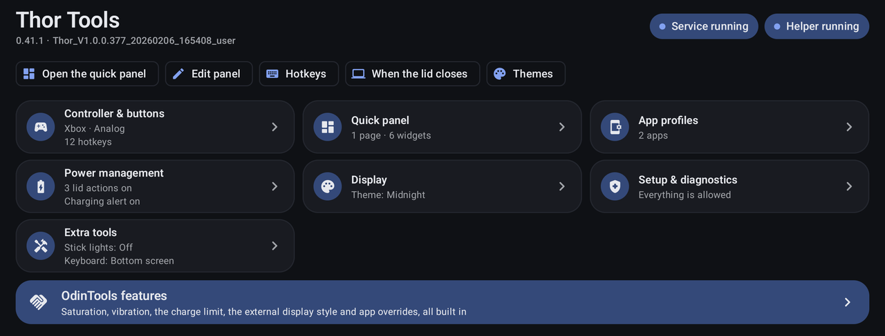</p>

## Screenshots

<table>
  <tr>
    <td valign="top" width="50%">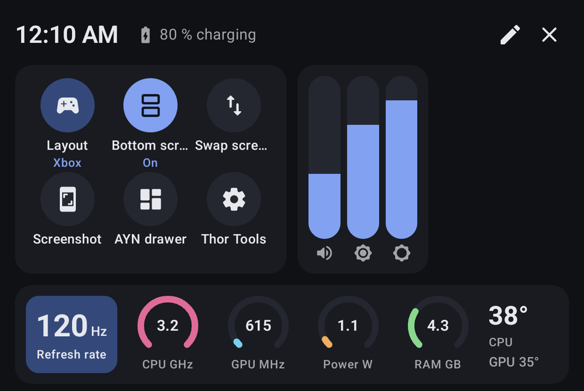</td>
    <td valign="top" width="50%">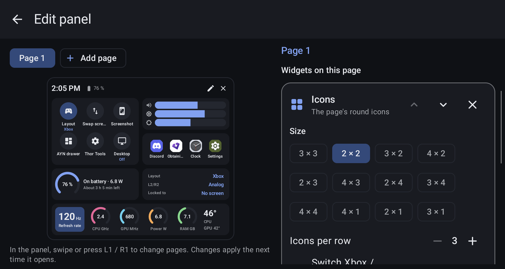</td>
  </tr>
  <tr>
    <td align="center">The quick panel, opened with the AYN button</td>
    <td align="center">Edit panel: widgets in the sizes you like</td>
  </tr>
  <tr>
    <td valign="top">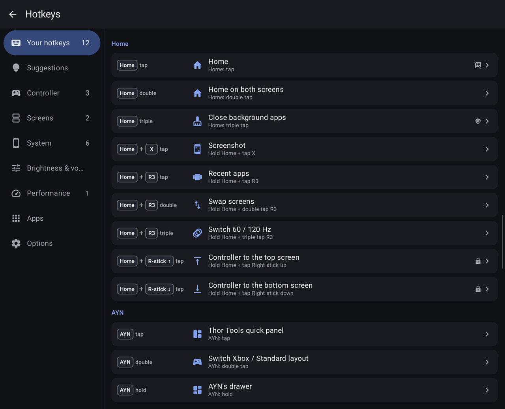</td>
    <td valign="top">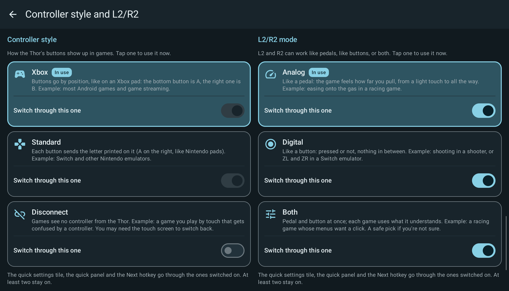</td>
  </tr>
  <tr>
    <td align="center">Hotkeys: taps, holds and combos</td>
    <td align="center">Controller style and L2/R2</td>
  </tr>
  <tr>
    <td valign="top">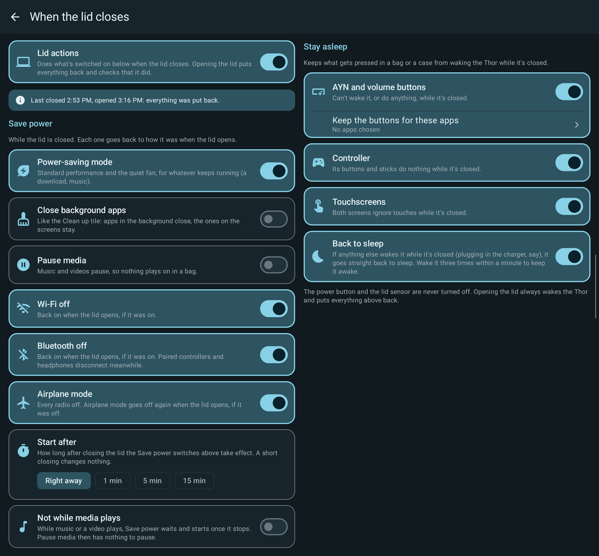</td>
    <td valign="top">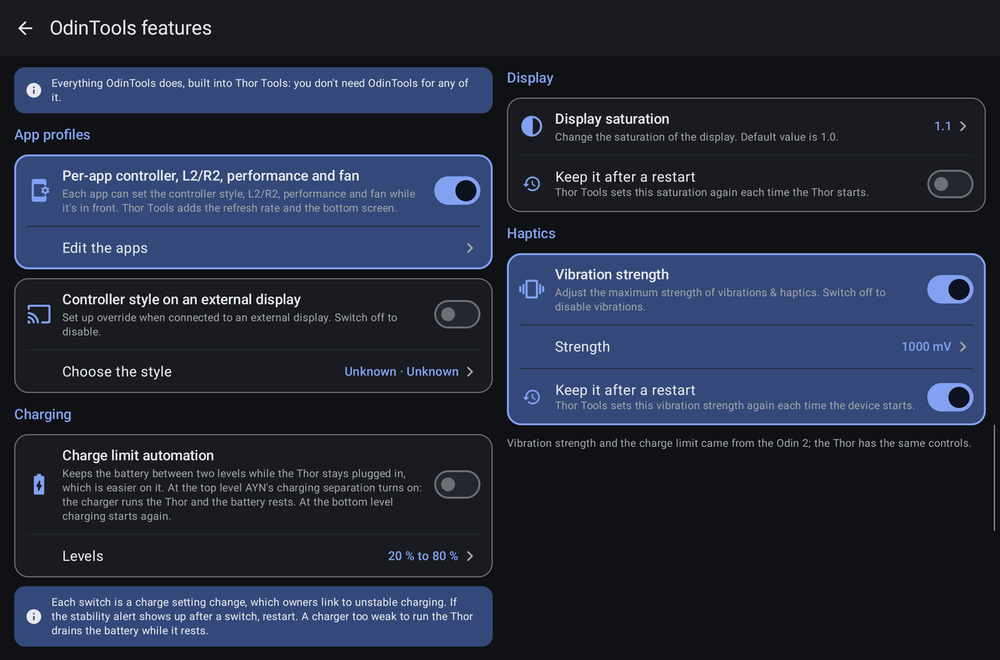</td>
  </tr>
  <tr>
    <td align="center">What happens when the lid closes</td>
    <td align="center">Every OdinTools setting, built in</td>
  </tr>
  <tr>
    <td valign="top">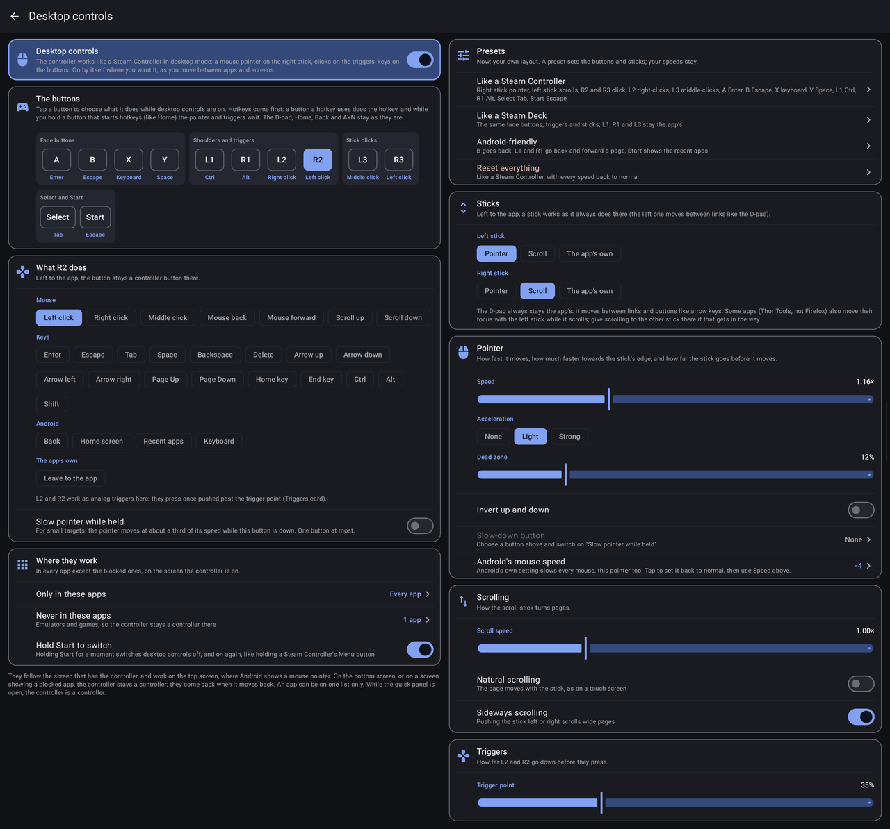</td>
    <td valign="top">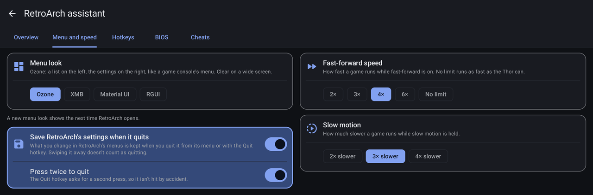</td>
  </tr>
  <tr>
    <td align="center">Desktop controls: the controller as a mouse and keyboard</td>
    <td align="center">The RetroArch assistant: menu look, speeds, hotkeys, BIOS files and cheats</td>
  </tr>
  <tr>
    <td valign="top">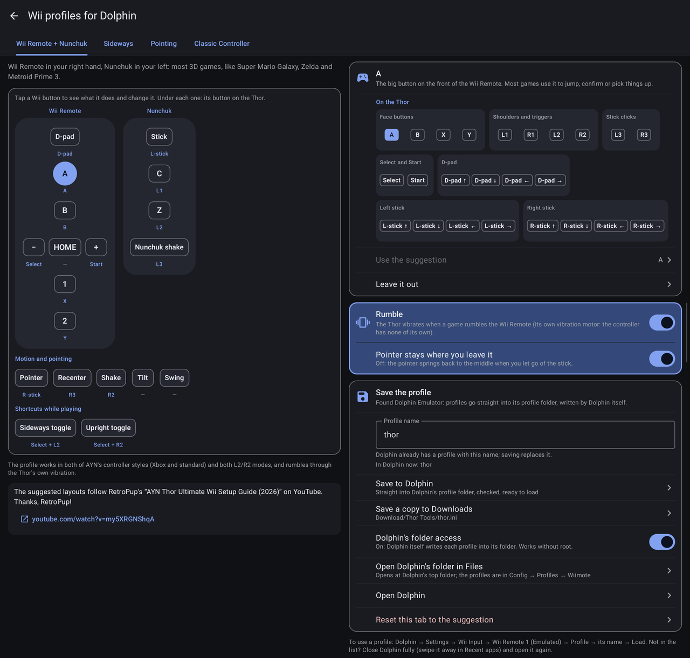</td>
    <td valign="top">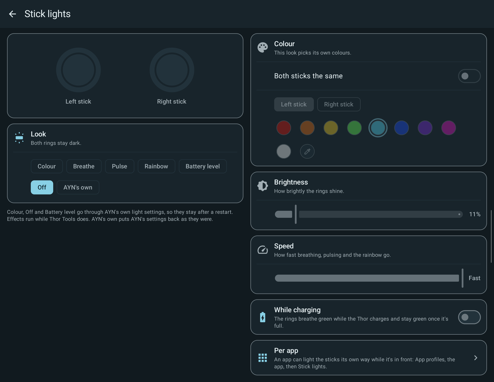</td>
  </tr>
  <tr>
    <td align="center">Wii Remote, Nunchuk and Classic Controller profiles for Dolphin</td>
    <td align="center">Colours and effects for the stick lights</td>
  </tr>
  <tr>
    <td valign="top">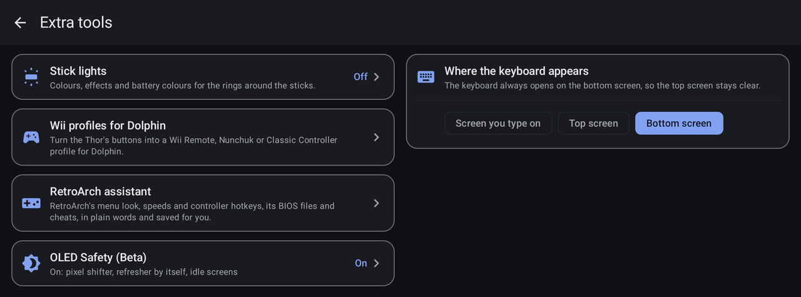</td>
    <td valign="top">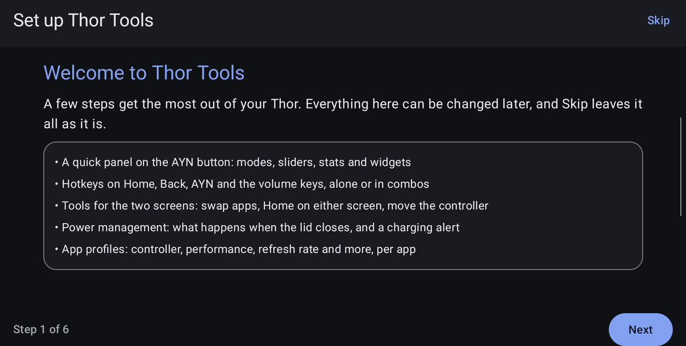</td>
  </tr>
  <tr>
    <td align="center">Extra tools: stick lights, Wii profiles, the RetroArch assistant and OLED Safety</td>
    <td align="center">A guided setup on first start</td>
  </tr>
</table>

## Works alongside OdinTools

Thor Tools has its own package name, so both apps can be installed at the same time. Some features change the same
system settings OdinTools does: per-app controller style, L2/R2, performance and fan; the external display style;
charge automation; and saturation or vibration re-applied at boot. **If OdinTools is installed, those features start
switched off in Thor Tools.** Each of them carries a small *OdinTools* tag in its menu, and the *OdinTools
coexistence* page under Setup & diagnostics explains each one.
You can still switch any of them on. Turn the matching feature off in OdinTools first, so the two apps don't undo
each other. Without OdinTools you won't see any of this: Thor Tools has every OdinTools setting in its own menus.

## Features

### Quick panel (AYN button)
- A tap of the AYN button opens a panel on the bottom screen; holding AYN still opens AYN's own drawer. Use it by
  touch or with the D-pad, and swipe or press L1 / R1 for more pages
- Every page is a grid of widgets, each in a choice of sizes:
  - **Icons**: switch the Xbox / Standard layout, cycle controller style, L2/R2, performance and fan, 60 / 120 Hz,
    swap screens, bottom screen on/off, screenshot, Recent apps, close the current app, AYN's drawer and much more
  - **Sliders**: volume and the brightness of each screen, standing or lying down
  - **Device stats**: refresh rate, CPU, GPU, power, memory and temperatures
  - **Now playing**: what's playing, with play, pause and skip
  - **Battery and charging**: level, watts in or out, time to full or time left
  - **Performance graph**: CPU, GPU and temperature over the last minute
  - **App shortcuts**: your apps, opened on the screen you choose
  - **Notes**: draw on it with a finger, or type a note in the app
  - **Play timer**: how long the game in front has been open, with an optional break reminder
  - **Recent apps**: the apps you opened last, one tap to go back
  - **Controller status**: layout, L2/R2, the lock and which screen has the controller; tap a line to change it
  - **Clock and timer**: the time, a stopwatch and a countdown that keeps running with the panel closed
  - **Screenshots**: your latest screenshots; tap one to open it
  - **Storage and memory**, **Network** (Wi-Fi signal and ping) and **Quick toggles** (Wi-Fi, Bluetooth, airplane
    mode, Do not disturb)
- Arrange pages and widgets in the panel editor with a live preview; open it from the pencil in the panel
- By default only the AYN button (or the panel's close button) closes it, so you can use several tiles in a row

### Hotkeys
- Taps, double and triple taps and holds of Home, Back, AYN and the volume keys, and combos (hold one button, press
  another, including a D-pad direction or a stick flick) run any action or open an app on the screen you choose
- A single press of Home or Back still does its usual job, and game buttons are only used in combos, so games keep
  their controls
- Record a hotkey by pressing it, start from ready-made suggestions (the Thor Profile among them), limit a hotkey to
  chosen apps (it takes the place of the usual one there) or turn hotkeys off per app; a hotkey can show what it did
  on screen, and a controller move can also lock the controller there

### Desktop controls
- The controller as a mouse and keyboard in browsers and other apps, like a Steam Controller in desktop mode: a
  pointer on one stick, scrolling on the other, clicks on the triggers and keys on the buttons, on the top screen
- Every button's job can be changed (mouse buttons, Enter, Escape, Tab, arrows, Ctrl, Alt and more, Back, Home,
  Recent apps, the on-screen keyboard, or left to the app), with presets, pointer and scroll speed, acceleration,
  dead zone, a slow-down button and the trigger point
- Only in the apps you choose, never in the ones you block (your emulators and games); hold Start to switch them off
  and on, or use the "Desktop controls on/off" hotkey action or quick panel tile
- Hotkeys come first: a button a hotkey uses does the hotkey, and while you hold a button that starts hotkeys the
  pointer waits

### Two screens
- Swap the apps between the screens, close the other screen's app, Home on the screen you're using or on both
- Move the controller to the top or bottom screen, and lock it there
- Brightness per screen

### Power management
- **When the lid closes**: kept simple: Wi-Fi and Bluetooth off while it's closed (back on when it opens, if they
  were on), and back to sleep after an accidental wake (plugging in the charger, say) once the lid is still closed
  after a wait you set: 5 to 60 seconds or 1 to 15 minutes. Buttons, the controller and the touchscreens are never
  turned off. Everything is off until you switch it on. For much more, it points to
  [SleepManager](https://github.com/Baggio94/SleepManager)
- **Charging stability alert**: a notification when charging keeps switching between rapid, slow and not charging,
  with a restart button. The screen explains the Thor's known charging issue, what owners report helps and what's
  normal
- **Charge limit automation**: keeps the battery between two levels while plugged in, using AYN's charging
  separation, with a warning when AYN's own 80 % limit gets in the way
- **Charging right now**: charger type, the watts it offers and the watts coming in, battery health, and whether
  AYN's 80 % limit and charging separation are on

### App profiles
- Per app: controller style, L2/R2 mode, performance and fan (from OdinTools), plus refresh rate, the bottom screen
  off while the app is on the top screen, vibration strength (off to strongest) and the stick lights; everything goes
  back when you leave the app

### Extra tools
- **Stick lights**: the rings around the sticks in a colour (both sticks or each its own, nine colours or your own),
  Breathe, Pulse, Rainbow or the battery level, off, or AYN's own look; brightness and speed, a green breathe while
  charging, and a different look per app. A colour, off and the battery level stay after a restart
- **Wii profiles for Dolphin**: turn the Thor's buttons into a Wii Remote + Nunchuk, a sideways Wii Remote, a pointing
  Wii Remote or a Classic Controller, with the pointer and shake on the sticks and triggers and Dolphin's sideways and
  upright shortcuts. Every Wii button is explained in plain words and drawn with the Thor button under it, starting
  from a ready-made layout. Profiles work in both of AYN's controller styles and both L2/R2 modes and rumble through
  the Thor. Save goes straight into Dolphin's profile folder (through AYN's system service, or through Dolphin's own
  folder access, given once), with a copy in Downloads and the folder path as a fallback
- **RetroArch assistant**: RetroArch's menu look, fast-forward and slow-motion speeds and its controller hotkeys in
  plain words, changed in RetroArch's own settings file for you (with an undo). A BIOS finder copies the right BIOS
  files from your download folder into RetroArch's BIOS folder, checked by their contents. Cheats: Thor Tools finds
  your games, matches each one to libretro's cheat database (downloaded per game or as one pack) and adds the cheats
  you tick where RetroArch loads them by itself
- **Where the keyboard appears**: always on the bottom screen, on the top screen, or on the screen you type on
- **OLED Safety (Beta)**: burn-in protection for both screens, each on its own. A pixel shifter that moves a screen a
  pixel at a time, all the time or only while its picture stays still (in games too, and an animated home screen on the
  other screen doesn't stop it); a refresher (sweep, noise, colours or a negative of the screen) that can run by itself
  on a screen that has stayed still, or from a hotkey or the quick panel; dim or black out a screen nobody has touched
  for a while; still areas (Pre-Beta: a game's HUD or a logo dimmed, or only its pixels moved, while the rest of the
  game plays); and AYN's own shifter and refresher, set from here

### From OdinTools (all in the OdinTools features menu)
- Controller and L2/R2 style for external displays
- Quick settings tiles that cycle the controller style and L2/R2 mode
- Display saturation, vibration strength and charge-limit automation (also in Power management), each kept after a
  restart if you like; on the Odin 2 also M1/M2 remapping

### Look and setup
- A main menu that shows how everything stands at a glance, with shortcuts to the pages you use most
- Themes for the app and the panel: Midnight, Graphite, Glacier, Ember, Forest, Sakura, Abyss, Lavender, Neon, Dot
  Matrix, Amber, Daylight, Mint, Sand or Android's own colours. Make your own, or copy any theme and change it, with a
  live preview beside the colours
- A guided setup on first start (access, hotkeys, the quick panel, a theme), and again any time from Setup &
  diagnostics
- Permissions & access: every permission Thor Tools relies on, with its real state and a one-tap fix
- Diagnostics: device facts, a button tester, and a report you can copy or save to Downloads; a debug mode adds a
  toolkit that checks every action and recognises your hotkeys
- Stays running: a quiet notification, a battery-optimisation exemption and a check after boot

### Planned
- AYN's 80 % limit, charging separation and charge caps as switches, and a charging log
- Screen modes and bottom-screen auto-off

## Install

1. Download `ThorTools-<version>.apk` from the [Releases](https://github.com/ThatOneCodingPerson/ThorTools/releases)
   page, or build it yourself (below).
2. Copy it to the Thor and open it to install.
3. Open Thor Tools and turn on its accessibility service when it asks; Setup & diagnostics shows anything else it
   needs. It uses AYN's built-in system service, so there's no root, Shizuku or ADB to set up. AYN's
   **"Force SELinux"** option must be off, which is the factory default.

To update, install the newer APK over the old one; your settings stay. Releases are signed with the project's key and
an APK you build yourself is signed with your own, so switching between the two means uninstalling first.

**Upgrading from 0.1.0:** uninstall it first. That build used OdinTools' package name, so it can't be updated in
place, and it would keep running next to the new one. Thor Tools shows a reminder while it is still installed.

## Build

Requirements: JDK 25 and the Android SDK (Android Studio installs it).

```
build-apk.cmd          lint, unit tests and a signed release APK in dist\
build-apk.cmd fast     APK only
build-apk.cmd clean    from a clean build directory
```

On the first run the script creates a personal signing key in `%USERPROFILE%\.thortools`. Back that folder up:
updates must be signed with the same key.

## Credits and license

Based on [OdinTools](https://github.com/langerhans/OdinTools) © 2024 Maximilian Keller (langerhans), MIT licensed.
Thor Tools changes and additions are also MIT. See [LICENSE](LICENSE).

Cheats come from [libretro-database](https://github.com/libretro/libretro-database) (CC BY-SA 4.0), downloaded onto
the Thor when you ask for them; none are included in the app.

The Wii profile builder's suggested layouts follow RetroPup's
[AYN Thor Ultimate Wii Setup Guide (2026)](https://www.youtube.com/watch?v=my5XRGNShqA). Thanks, RetroPup!
